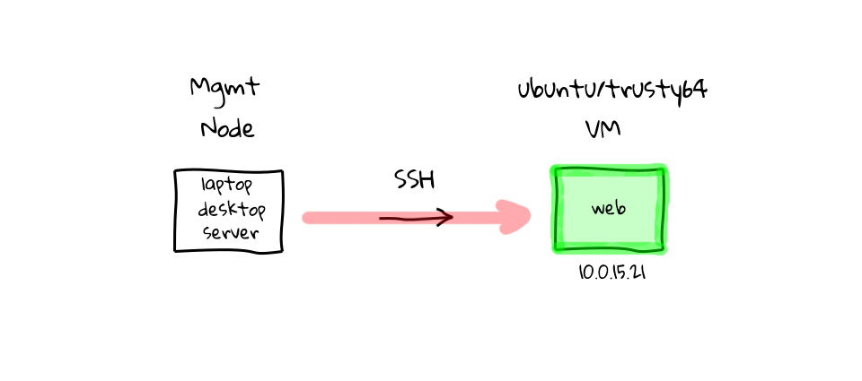
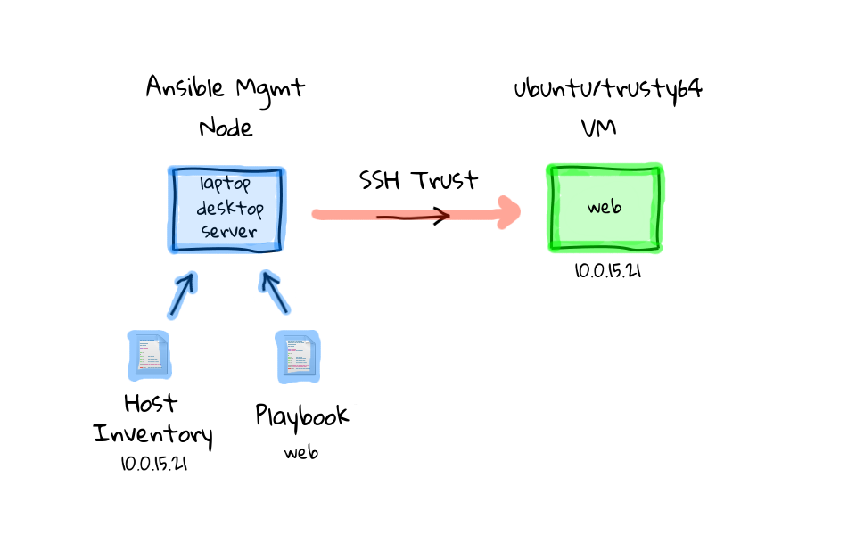

<!-- $theme: gaia -->

<center>
<br><br>

<!--###### Materials @ [https://github.com/prodicus/talks](https://github.com/prodicus/talks)-->
<br>

# ==Introduction to Ansible==

<br>
<br>


###### Tasdik Rahman ([@tasdikrahman](https://twitter.com/tasdikrahman/))

###### Engg. Intern @ Cisco, formerly Wingify(S16)

<br>

<!--###### Presented @ BangPypers, April'17 meetup -->


</center>

---

<!-- page_number: true -->

<br><br>

# Brief history

- A configuration management tool, deployment tool, and ad-hoc task execution tool all in one.
- Initially developed by Michael DeHaan.
- Inspired by Func (previously used by tumblr)
- Userbase includes NASA, Apple, Juniper et al.

---
<!-- *template: invert -->

# Why Ansible? Or any other tool for that matter?

---

## Before Configuration management

- manual configuration.
- results in Flaky servers.





---

## Enter Ansible

- Follows a push approach.
- Agentless.
- Uses OpenSSH for transport.
- Easy to understand `yaml` styled configuration.
- Requires `python` installed on the managed node
- Runs tasks in a sequential manner. 
- Immutable infrastructure.
- _**Idempotency!**_

---

<center><h2>Using Ansible</h2>

Brings server to a known/deterministic state.
<center>


---

# Inventory

- sample `/etc/ansible/hosts` file

```yaml
[testdroplets]
ubu ansible_ssh_host=139.59.3.235
icinga ansible_ssh_host=139.59.24.40

[testansible]
host0.example.org ansible_host=192.168.33.10 
host1.example.org ansible_host=192.168.33.11 
host2.example.org ansible_host=192.168.33.12 

[testansible:vars]
ansible_user=tasdik
```

- From `v2.0`, Ansible  has deprecated the `ssh` above.
---

#### Inventory

- holds a _list_ of Ansible-managed servers
- by default, hosts picked up from `/etc/ansible/hosts`
- can also be specified by giving `-i <path>` option on the command line.
```yaml
[testdroplets]
ubuntu1404
```
- `[testdroplets]` would be the groupname inside which `ubuntu1404` is a host.

---

- A host can co-exist in two groups at the same time.
```
[webservers]
foo.example.com

[dbservers]
foo.example.com
```
- Ansible will look for additional variables definitions in group and host variable files which will be searched in directories `group_vars` and `host_vars`, below the directory where the main inventory file is located.
- `group_vars/linux`
`host_vars/host0.example.org`

---

## Ad-hoc commands

- would be something that you might type in to do something really quick, but don’t want to save for later.
- Ansible has a great deal of modules 


###### General syntax

```
$ ansible <HOST_GROUP> -m <MODULE_NAME> \
  -a "OPT_ARGS" -u <USERNAME>
```
- basically used for things which you don't want to write a playbook for!


---

##### Show us one

```
$ ansible testdroplets -l ubu \
  -u root \
  -m shell -a "free m"
```
- using `-l ubu` to limit the command to only the server with hostname `ubu` inside the `testdroplets` group (or in ansible terms, a "pattern")
- specifying `root` as the remote user to ssh into on the remote machine with `-u`.
- `-m shell` means use module "shell".
- as shell module takes additional params i.e the command to be run, passing it through `-a` switch.


---
<!-- *template: invert -->


# Ansible playbooks

---

#### Playbook's you said?

 - just a series of ansible commands (tasks), like the ones we used with the ansible CLI tool. These tasks are targeted at a specific set of hosts/groups.
 - expressed in `YAML` format
 - Each playbook is composed of one or more ‘plays’ in a list.
 - The goal of a play is to map a group of hosts to some well defined roles, represented by things ansible calls tasks. 
 - At a basic level, a task is nothing more than a call to an ansible module

---


```
---
- hosts: nginx
  remote_user: root
  vars:
    message: "Welcome to the Aril Meetup!"
  tasks:
    - name: nginx | Install
      apt: pkg=nginx state=installed update_cache=true
    - name: nginx | remove default index.html
      file: 
      	path: /var/www/html/index.nginx-debian.html
        state: absent
    - name: nginx | copy template site
      template:
      	src: files/index.html.j2
        dest: /var/www/html/index.nginx-debian.html
      notify:
        - restart nginx
  handlers:
    - name: restart nginx
      service: name=nginx state=restarted
```

---

- You can have multiple **plays** in your **playbook**.
```
---
- hosts: web
  tasks:
  	name: foo
        task: ...

- hosts: db
  tasks:
  	name: foo
        task: ...
```
- `hosts` :  a list of one or more groups or host patterns, separated by colons
- `remote_user` : just the name of the user account

---

- tasks items can be brokdn down over multiple lines to improve the structure

```yaml
...
- tasks:
  	name: foo
        apt: pkg=nginx state=installed
...
```
- can be written using `YAML`'s dict to pass `key=value`
```yaml
...
- tasks:
  	name: foo
        apt: 
	   pkg:nginx 
	   state:installed
...
```

---

<center>

<br><br>

# Tasks

<br>

Are executed in order, one at a time, against all machines matched by the host pattern, before moving on to the next task.


---


<!-- *template: invert -->

<center>
<br>

## But wouldn't this become messy for complex tasks? 

<br>

### ==YES!==

<br>

### How?


---

## Ansible Roles

---

### What do they do?

- as we add more & more functionality to our playbook, it becomes unreadable at some point.
- allow you to create very minimal playbooks that then look to a directory structure to determine the actual configuration steps they need to perform.
- enforces modularity so that we can resuse commonly used tasks(roles) again.

---

### Organising your roles

```
roles/
   common/
     files/
     templates/
     tasks/
     handlers/
     vars/
     defaults/
     meta/
```

In a playbook, it would look like this:

```
---
- hosts: webservers
  roles:
     - common
```

---


- `files` : contains regular files/scripts that need to be transferred to the hosts you are configuring for this role.
- `handlers` : All handlers that were in your playbook previously can now be added here.
- `meta` : can contain files that establish role dependencies. You can list roles that must be applied before the current role can work correctly.
- `templates` : place all files that use variables to substitute information during creation here.
- `tasks` : contains all of the tasks in a playbook. 
- `vars` : Variables for the roles can be specified in this directory and used in your configuration files.

---

<br><br>

<center><h1>what goes inside these?</h1>

<br>

<h5>Within all of the directories but the `files` and `templates`, if a file called `main.yml` exists, its contents will be automatically added to the playbook that calls the role</h5>

---


```
roles
├── basic_server_hardening
│   ├── defaults
│   │   └── main.yml
│   ├── handlers
│   │   └── main.yml
│   └── tasks
│       └── main.yml
├── create_new_user
│   ├── defaults
│   │   └── main.yml
│   └── tasks
│       └── main.yml
└── vimserver
    ├── defaults
    │   └── main.yml
    ├── files
    │   └── vimrc_server
    └── tasks
        └── main.yml
```

---

<!-- *template: invert -->

>If Ansible modules are the tools in your workshop, playbooks are your instruction manuals, and your inventory of hosts are your raw material.
> <small>-- *[http://docs.ansible.com/ansible/playbooks.html](http://docs.ansible.com/ansible/playbooks.html)*</small>

---

# References

- ###### http://docs.ansible.com/ansible/intro_adhoc.html
- ###### http://docs.ansible.com/ansible/intro_inventory.html
- ###### http://docs.ansible.com/ansible/intro_patterns.html
- ###### http://docs.ansible.com/ansible/playbooks.html
- ###### http://docs.ansible.com/ansible/playbooks_roles.html
- ###### http://docs.ansible.com/ansible/modules.html
- ###### http://docs.ansible.com/ansible/YAMLSyntax.html


---

<center>

<br><br>
# ==Questions?== 
#### Would be happy to answer them!

<br>

#### http://tasdikrahman.me/

###### Twitter ([@tasdikrahman](https://twitter.com/))

###### Github ([@prodicus](https://github.com/prodicus))

###### Materials for the talk @ [https://github.com/prodicus/talks](https://github.com/prodicus/talks)